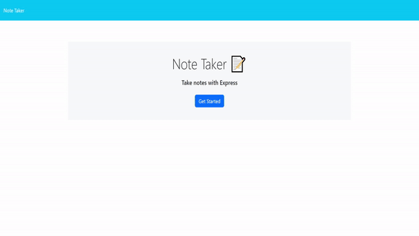

# Note Taker Express

## Description

Note taker express is a website where you can view, add and delete notes saved onto the web server.

## Table of Contents

- [Installation](#installation-instructions)
- [Usage](#usage-info)
- [Questions](#questions)

## Installation Instructions

Simply <a href="https://note-taker-express-vq6h.onrender.com/">click here</a> to go to the home page and get started

## Usage Info

Once on the home page, Press the Get Started button which will take you to the notes page. From there, if you wish to read an existing note, they will appear on the left hand side. Clicking on one will load it up to view the title and the text. From there if you wish to add a new note, click on the new note button found on the top right hand side. After you have entered a Note title and note text, you will see a button to save that note. Saving it will add it to the sidebar so you can view it anytime. To delete a note, simply click on the notes corresponding delete icon and it will be removed.

Here is a demo to show you some examples mentioned above:

## Questions

If you wish to see any of my other works,
here is a link to my GitHub Page: [CinosMagician](https://github.com/CinosMagician)

If you wish to contact me directly, please email me: lachyhughes@bigpond.com
